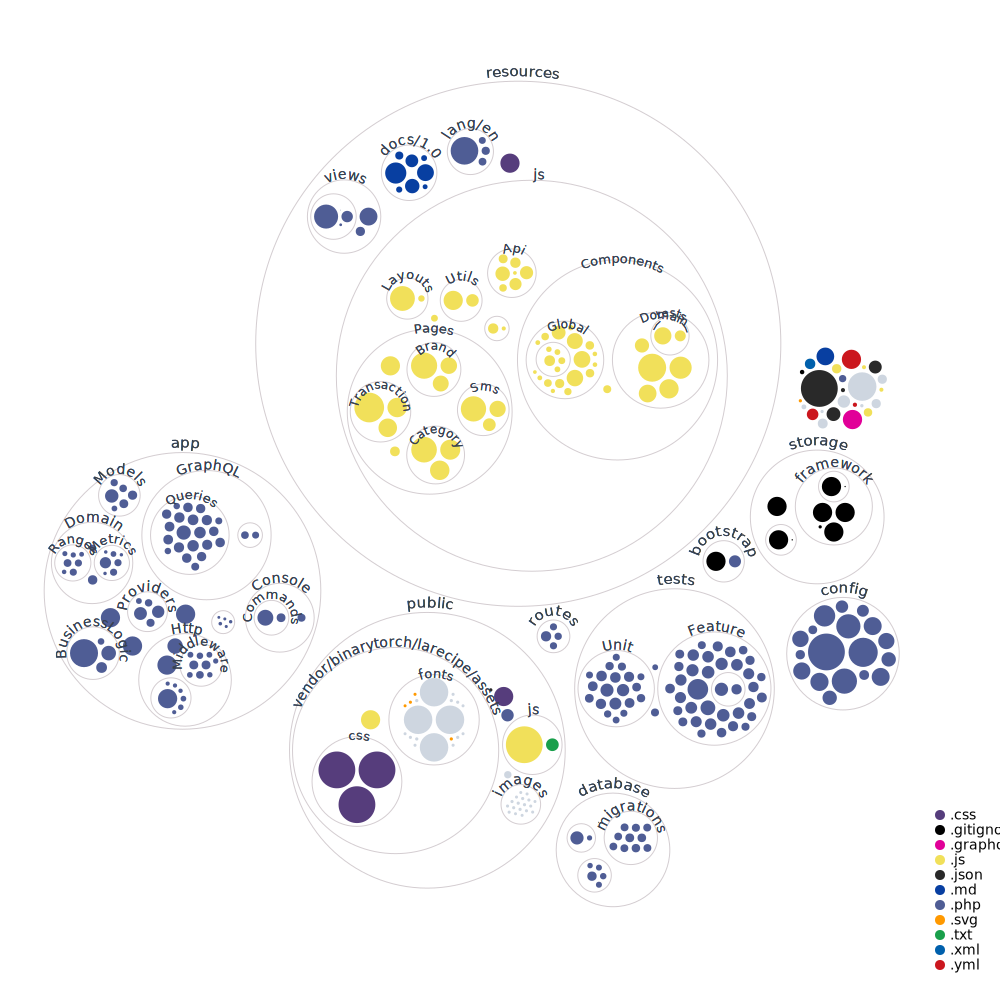

<h1 align="center">DOMPET ONLINE</h1>

<p align="center">
  <b>DOMPET ONLINE adalah aplikasi masa kini yang berguna untuk mengatur pemasukan dan pengeluaran dana yang kita miliki</b>
</p>


## ▶️ Installation 

> Docker Installation

```bash
# step 1: clone the repo
git clone https://github.com/saleem-hadad/finance && cd finance

# step 2: create .env file
cp .env.sail.example .env

# step 3: install deps via composer
docker run --rm \
    -u "$(id -u):$(id -g)" \
    -v $(pwd):/var/www/html \
    -w /var/www/html \
    laravelsail/php81-composer:latest \
    composer install --ignore-platform-reqs

# step 4: serve the app
./vendor/bin/sail up -d

# step 5: generate app key
./vendor/bin/sail artisan key:generate

# step 6: run migration
./vendor/bin/sail artisan migrate

# step 7: run install command and follow the instructions
./vendor/bin/sail artisan finance:install
```

Once done, visit the app on `http://localhost`


> Normal Laravel App

Cara Lain:

```bash
# step 1: clone the repo
git clone https://github.com/saleem-hadad/finance && cd finance

# step 2: create .env file
cp .env.example .env

# step 3: install deps via composer
composer install

# step 4: generate app key
php artisan key:generate

# step 5: run the migration
php artisan migrate

# step 6: run install command and follow the instructions
php artisan finance:install

# step 7: serve the app
php artisan serve
```

buka aplikasi di `http://localhost:8000`


Aplikasi ini mengandung:

1. Laravel
2. Inertia & ReactJs
3. GraphQL
4. MySQL
5. Docker




## 🔖 Hak Cipta

Dalam Project ini kami mengambil link github dari [LICENSE.md](https://github.com/saleem-hadad/finance/blob/main/LICENSE) dan mengubah tampilannya
